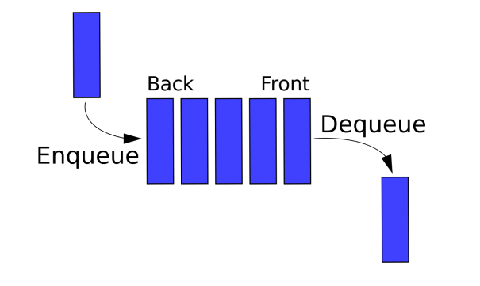

# Python Queues
## What is a Python Queue?

In python, a queue is a data structure following the common practice of "FIFO". This is otherwise known as "First in, First Out". The benefit of using the "FIFO" method is it provides everyone a fair opportunity to access something. In real like this would be like people waiting in line for a cashier. It allows everyone to gain access to the cashier, give the cashier their groceries and get checked out. 

The common terms for this data structure are Enqueue and Dequeue. Enqueue is when we place a new item into the queue, or if someone joins the end of the line in a checkout line. Dequeue is the opposite where the item that is oldest or at the first spot in the queue is taken off.

The python queue follows this same idea. One example would be when a website has a high volume of requests and is throttling the connection of the visitors. To be fair, it will allow those who joined first to be allowed access into the website at the earliest possible time and retrieve the data that they requested. 

## Python Queue Performance
The performance of the different functions associated with python queues are as follows: 

            .append(value) - This places a value at the end of a python queue/list.
                Performance = O(1)
                
            .pop(0) - This will remove the first item in the queue, following the "FIFO" pattern.
                Performance = O(n)

            len(my_queue) - This will give us the total amount of items in a queue/list. You can also check if the queue is empty by seeing if the length equals zero.
                Performance = O(1)
            
## Python Queue Example
They python code for queues can be found here: 
[Queue Python Example](1-queue.py)

# Insert screenshot of working code here with comments

