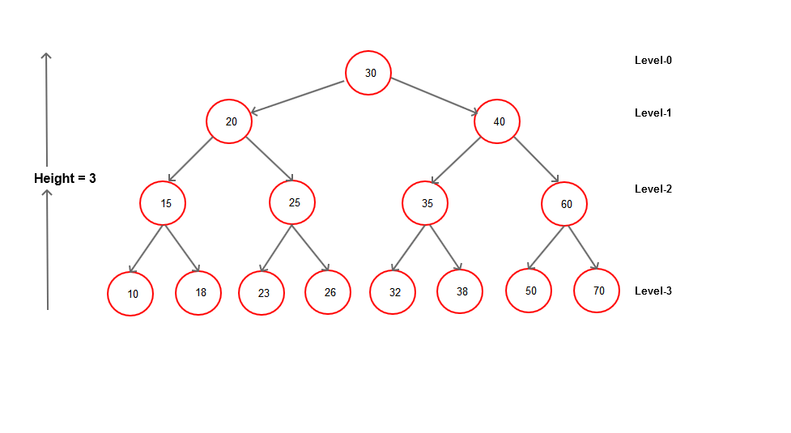

# Binary Trees
## What is a binary tree in python?

In Python, a tree is another example of a linked list but can be linked to different nodes extending from it. Although they can link to multiple other nodes, there are different kinds of python trees that have separate purposes. 

## Binary Trees
- 

## Binary Search Tree
- 

## Balanced Binary Search Tree
- 

A real world example of a practical use of this would be...

## Python Tree Example
They python code for a tree can be found here: 
[Queue Tree Example](3-trees.py)

# Insert screenshot of working code here with comments